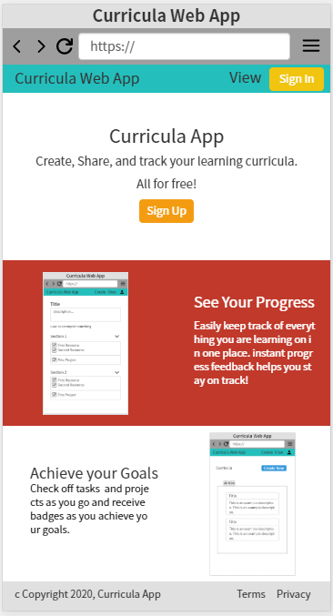
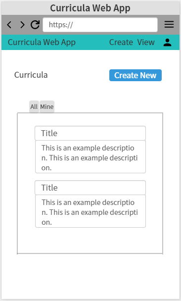
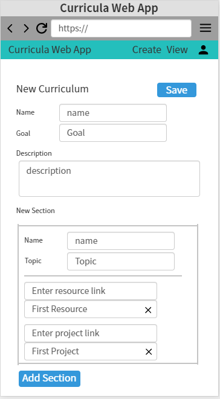
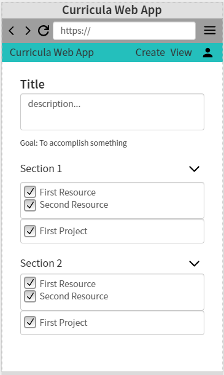
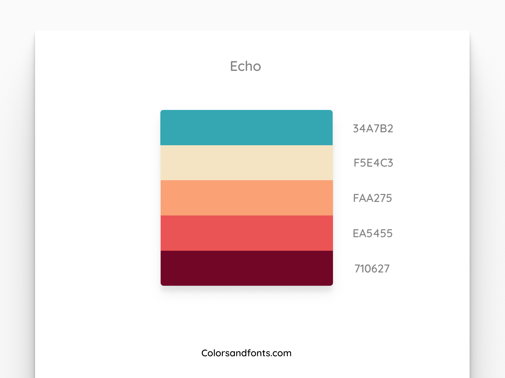

# Curriculum Web App

- Reference to [Faraday Academy](https://www.youtube.com/watch?v=T_NbpN-UmNE&list=PLFBirL3MAv2-c8VpBJMvH8Hci975MLVU1)

 

## Table of Contents

1. [How to Run?](#how-to-run)
2. [Tech Stack](#tech-stack)
3. [Mockups](#mockups)
4. [Design](#design)
5. [Routes](#routes)
6. [Schema](#schema)
7. [API](#api)
8. [MVP Features](#mvp-features)
9. [Version 1 Features](#version-1-features)

 

## How to Run?

> cd curriculum-front
>
> npm i
>
> npm run serve

 

## Tech Stack

- VueJS / Vue Router / Vuex
- Vuetify
- NodeJS / ExpressJS
- MongoDB / Mongoose
- Digital Ocean (hosting)

 

## Mockups

- Oven - [Link](https://ovenapp.io/)

1. home_landing page

   

2. show_all_curricula page

   

3. create_curricula page

   

4. update_curricula page

   

 

## Design

- [Colorsandfonts.com](https://www.colorsandfonts.com/index.html)

- Echo

  

 

## Routes

- "/"
  - Home Page / Landing Page
- "/curricula"
  - shows all curricula
- "/curricula/create"
  - shows form to create
- "/curricula/id"
  - shows single curriculum
- "/curricula/id/update"
  - update single curriculum

 

## Schema

**curricula**

- id: UUID (pk)
- name: string
- goal: string
- description: string
- sections: [object]
  - name: string
  - resources: [object]
    - isCompleted: boolean (default: false)
    - name: string
    - url: string
  - projects: [object]
    - isCompleted: boolean (default: false)
    - name: string
    - url: string
- createdAt: timestamp
- updatedAt: timestamp

 

## API

- Prefix

  - > /api/v1

- Endpoints:

  - > /curricula

    - get
    - post

  - > /curricula/:id

    - get
    - patch
    - delete

 

## MVP Features

- [Difference between MVC, MVP, & MVVM design pattern_stackoverflow](https://stackoverflow.com/questions/19444431/what-is-difference-between-mvc-mvp-mvvm-design-pattern-in-terms-of-coding-c-s)
- [Comparing MVC, MVP, MVVM in web_githubBlog](https://magi82.github.io/android-mvc-mvp-mvvm/)

1. Home Page with list of curriculums
2. Form Page to create/update a curriculum
3. User can delete a curriculum

 

## Version 1 Features

1. Users can log in and save their curricula
2. Users can fork other user's curricula
